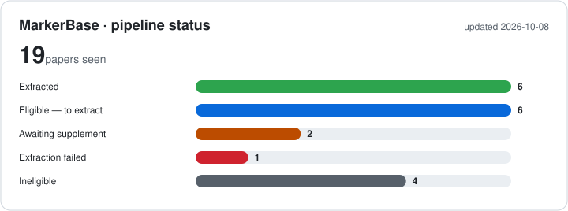

# IR MarkerBase — extraction pipeline

A pipeline that builds a database of **insecticide-resistance (IR) markers in
African *Anopheles*** from the literature: genotype counts at target markers
(kdr/Vgsc, Ace-1, Rdl, GSTe2, Cyp6p9a/b, Cyp6aa1, Cyp9k1) plus linked bioassays
and genotype–phenotype data, for spatial and temporal models of marker frequencies.

PDFs go into a Google Drive folder (or a local folder for testing). The pipeline
reads each one, decides whether it is eligible, extracts the data with an LLM,
checks it in code, and builds one combined table.

_Adapted from PfDR-MarkerBase-extract (P. falciparum drug resistance). The old
Pf data is preserved in git history (commit `7acfa7c`)._

## Status



<sub>Updates automatically on every run.</sub>

## Roster

<!-- ROSTER:START -->

**5 paper(s) · estimated spend $0.00** (eligibility $0.00 · extraction $0.00) · updated 2026-10-05

| id | source | status | eligible | confidence | duplicate_risk | needs_supplement | spec_version | first_seen | last_assessed | supp_attempts | supplement_fp | elig_model | elig_tok_in | elig_tok_out | extract_model | extract_tok_in | extract_tok_out | notes | est_$ |
|---|---|---|---|---|---|---|---|---|---|---|---|---|---|---|---|---|---|---|---|
| isabelleborloz,+5362_NTONGA_AKONO | master | EXTRACTED | True | high | low | False | 1 | 2026-10-05 | 2026-10-05 | 0 |  | gemini:gemini-3.5-flash | 6861 | 3893 | gemini:gemini-3.5-flash | 7986 | 17442 | 2 survey(s), 4 genotype, 12 bioassay, 0 geno-pheno rows; 4 warning(s) | 0.0000 |
| journal.pone.0332497 | master | AWAIT_SUPPLEMENT | True | high | low | True | 1 | 2026-10-05 | 2026-10-05 | 0 |  | gemini:gemini-3.5-flash | 7781 | 3736 |  |  |  |  | 0.0000 |
| s12936-021-03606-4 | master | EXTRACTED | True | high | none | False | 1 | 2026-10-05 | 2026-10-05 | 0 |  | gemini:gemini-3.5-flash | 9101 | 4765 | gemini:gemini-3.7-flash | 22346 | 13335 | 1 survey(s), 2 genotype, 1 bioassay, 0 geno-pheno rows; 2 warning(s) | 0.0000 |
| s12936-025-05696-w | master | INELIGIBLE | False | high | low | False | 1 | 2026-10-05 | 2026-10-05 | 0 |  | gemini:gemini-3.5-flash | 7481 | 2103 |  |  |  |  | 0.0000 |
| s13071-021-04706-5 | master | EXTRACTED | True | high | none | False | 1 | 2026-10-05 | 2026-10-05 | 0 |  | gemini:gemini-3.5-flash | 6941 | 1706 | gemini:gemini-3.5-flash | 8214 | 21826 | 9 survey(s), 2 genotype, 5 bioassay, 0 geno-pheno rows | 0.0000 |

_The table above is a static snapshot. For a searchable, filterable view (paginated for large sets), open [`data/roster.csv`](data/roster.csv) — GitHub renders CSV files as an interactive table._

<!-- ROSTER:END -->

## How it works

**Stage 1 — eligibility.** Each new PDF is checked against the spec in
`src/eligibility.py`: *Anopheles*; ≥1 target marker (`config/target_loci.csv`);
extractable genotype counts; field-collected (F0/F1) African mosquitoes; primary
study. Sub-country location and ≤3-year time window are recorded but not required.
Papers become *eligible*, *ineligible*, or **flagged** (possible duplicate /
needs supplementary files).

**Stage 2 — extraction.** For eligible papers the LLM fills five linked tables
(`study`, `surveys`, `genotypes`, `bioassays`, `geno_pheno`). It gives **raw counts
and text as reported**, with provenance (sentence/table, page, figure, supplement)
on every record. Then code:

- maps marker names to *An. gambiae* numbering (`L1014F` → `Vgsc L995F`);
- validates the data (`src/validate.py`: RR+RS+SS = N, dead ≤ exposed, IDs link,
  markers are targets, coordinates in Africa…), sending errors back to the LLM
  for repair;
- computes every derived value (allele/genotype frequencies, mortality, WHO
  phenotype, pyrethroid subtype…) and writes the final table
  **`data/final/ir_extraction.csv` / `.xlsx`** (`src/export.py`).

**LLM provider.** All model calls go through `src/llm.py`. The default is Google
Gemini (free tier, throttled and retried). Claude and OpenAI-compatible models
work by changing the model spec, e.g. `--model sonnet`.

## Quick start (local, no Drive)

```bash
python -m venv .venv && .venv/bin/pip install -r requirements.txt
# put GEMINI_API_KEY=... in the project's .env file (git-ignored, read automatically)
.venv/bin/python src/run_local.py papers/   # a folder of PDFs (git-ignored)
# → local_output/final/ir_extraction.xlsx
```

Options: `--only eligibility`, `--skip-eligibility` (e.g. for a hand-picked gold
set), `--model pro`, `--redo`. Supplementary files go in
`papers/supplements/<pdf name>/`.

## What humans edit

- `config/target_loci.csv` — the target markers and their aliases.
- `data/exclude.txt` — papers to skip.
- `data/duplicate_decisions.yaml` — `duplicate` / `unique` rulings on flagged papers.
- `Human verified` / `Coordinates verified` columns are for humans only; the
  pipeline always writes `FALSE`.

## More detail

Design notes, the file and secret reference, and how Drive access works:
**[docs/NOTES.md](docs/NOTES.md)**.
